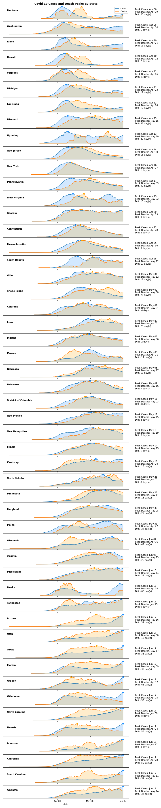

# Covid Analysis

This github repository contains a jupyter notebook that analyzes covid cases and recent death rates

Example from analysis.

### Weekly Deaths in NYC

### Death Multiplier in NYC

### Weekly Deaths in United States

### Weekly Covid 19 Deaths and Cases Peaks

